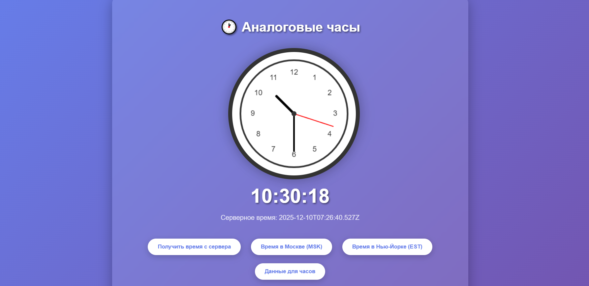

# КР4. 15 тема. Простой чат-бот.

Простой-чат бот способный выдавать несколько разных ответов. Была реализована имитация ответа с задержкой и временные метки сообщений.

# Технические детали
Фреймворк: React
Стили: CSS с анимациями
Хранение данных: Локальный state (не сохраняется при перезагрузке)
Взаимодействие: onClick и onKeyPress

# Работа бот
Пользователь открывает сайт → Загружается React-приложение → Создается начальное состояние чата.

Бот автоматически отправляет первое сообщение: 
"Привет! Я простой бот. Спроси меня о чем-нибудь!"

Пользователь видит:
- Историю сообщений (пока только приветствие)
- Поле для ввода текста
- Кнопку "✓" (отправить)

Пользователь вводит текст и нажимает "✓" или Enter → 
Сообщение добавляется в историю чата с пометкой "user" → 
Поле ввода очищается.

Сразу после отправки пользовательского сообщения:
- Появляется индикатор набора (три анимированные точки)
- Блокируется поле ввода и кнопка отправки

Через 1.5-2.5 секунды (случайная задержка):
- Индикатор набора исчезает
- Бот выбирает случайный ответ из предустановленного списка
- Ответ добавляется в историю чата с пометкой "bot"

Пользователь может продолжать диалог → 
Шаги 4-6 повторяются для каждого нового сообщения.