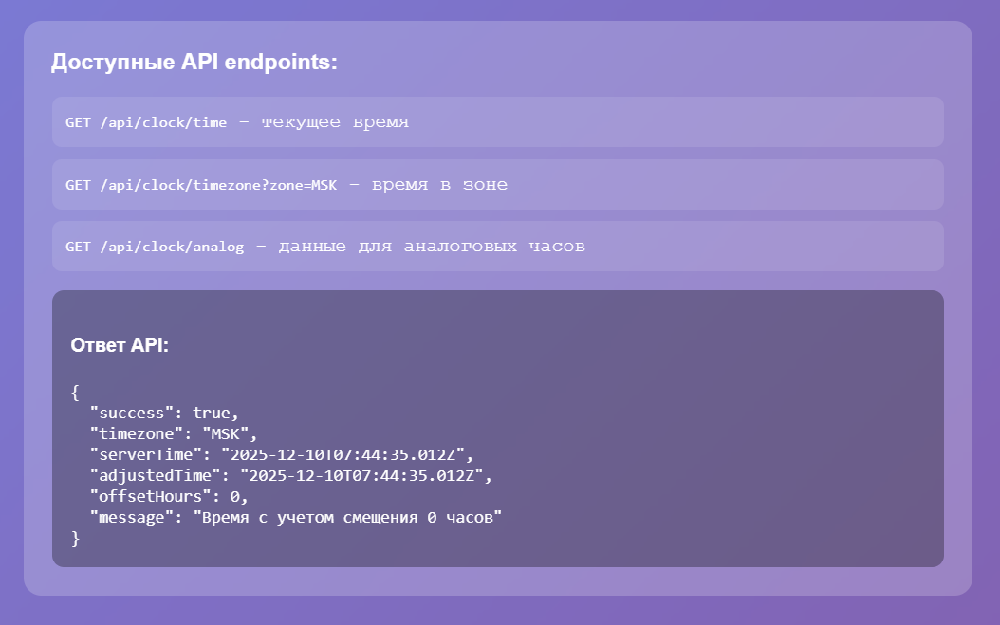
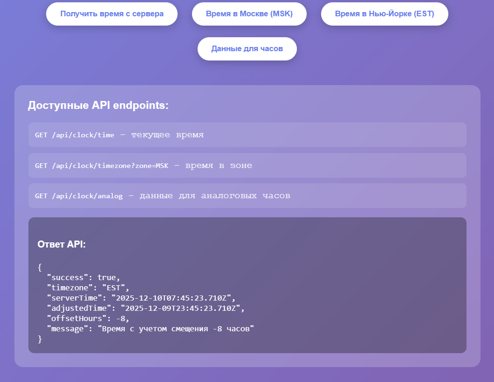

# КР4. 15 тема. Простой чат-бот.

Полноценное Express.js приложение для отображения аналоговых часов с серверным API.

# Технические детали
Фреймворк: Express.js (Node.js)
Сервер: Встроенный HTTP сервер Express
Стили: CSS с анимациями и градиентами
Хранение данных: Серверное время (реальное) и управление часовыми поясами

# Требования
Node.js 14+
npm или yarn

# Установка и запуск
1. Клонирование и установка зависимостей
git clone <repository-url>
cd analog-clock-api
npm install

2. Запуск сервера
npm start
# Или для разработки с авто-перезагрузкой:
npm run dev

3. Открыть в браузере
Перейдите по адресу: http://localhost:3000

# Аналоговые часы
Отрисовка в реальном времени с использованием Canvas API
Плавное движение стрелок
Стилизованный циферблат с цифрами
Разные цвета для часовой, минутной и секундной стрелок

# Управление
Кнопка "Получить время с сервера": Загружает актуальное время с API
Кнопки часовых поясов: Отображают время в Москве и Нью-Йорке
Кнопка "Данные для часов": Получает специализированные данные для отрисовки
Автообновление: Часы обновляются каждую секунду

# Визуальные особенности
Градиентный фон с эффектом размытия
Адаптивный дизайн
Анимация при наведении на кнопки
Тени и эффекты глубины